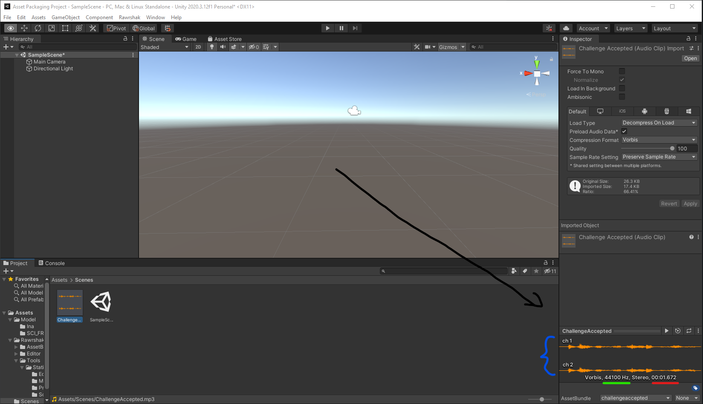

# Loading the Rawrshak Tools

#### 1. Download Unity (version 2020.3.12f1)

Download Unity: [https://unity.com/download](https://unity.com/download)

If Unity Hub is already installed, open the _Installs_ Tab and click the _Add_ button. Select the recommended version of Unity 2020.3+ and select next:

.png>)

Add Android, iOS, Universal Windows Platform, and WebGL Build Support:

.png>)

Select _Next and continue._

#### 2. Create 3D Project

In the _Project_ Tab, click the _New_ button (make sure the correct version is set). Select _3D_, add project name, and select _Create_.

.png>)


Please keep in mind Rawrshak currently only support the Built-in Render Pipeline.


#### 3. Install Editor Coroutines

In the Menu bar, open the Package Manager. Select _Window -> Package Manager_

Select the _Unity Registry_ from the dropdown, and scroll down to _Editor Coroutines_. Select _Editor Coroutines_ and click _Install._

.png>)

#### 4. Download Unity Tools from the github repo (releases)

Rawrshak Tools releases: [https://github.com/Rawrshak/Unity-Tools/releases](https://github.com/Rawrshak/Unity-Tools/releases)

Download the Rawrshak Unity Tools Unity Package.

#### 5. Drag and drop the Unity Tools package into the project

Open the folder where you downloaded the Unity Package.&#x20;

Drag and Drop the package in the Unity package in the Unity Window.

.png>)

Select "All" and click "Import"

.png>)

#### 6. Finished!
