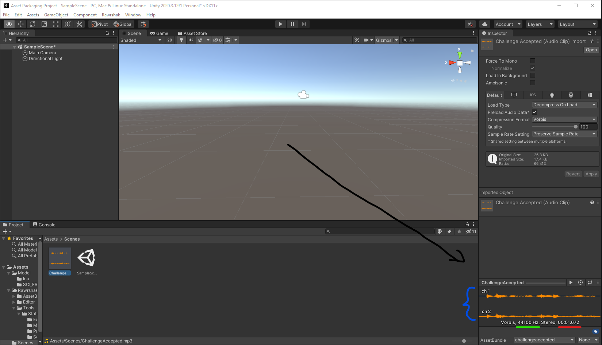

# Selling an Asset

#### 1. Go to Inventory Page in Developer Mode

 (1) (1).png>)

#### 2. Select the Asset to Sell

 (1).png>)

#### 3. Click _Sell_

#### 4. Enter the Amount to sell and the Price

 (1) (1).png>)

#### 5. Create and Deploy the Approval Transaction (if necessary)

 (1).png>)

#### 6. Click _Confirm Sell Order_ to create the sell order transaction and Deploy transaction

 (1) (1).png>)

#### 8. Verify Sell Order&#x20;

 (1).png>)


The Exchange subgraph takes a few seconds to a few minutes to update. Please wait for the transaction to succeed and propagate to the subgraph.

